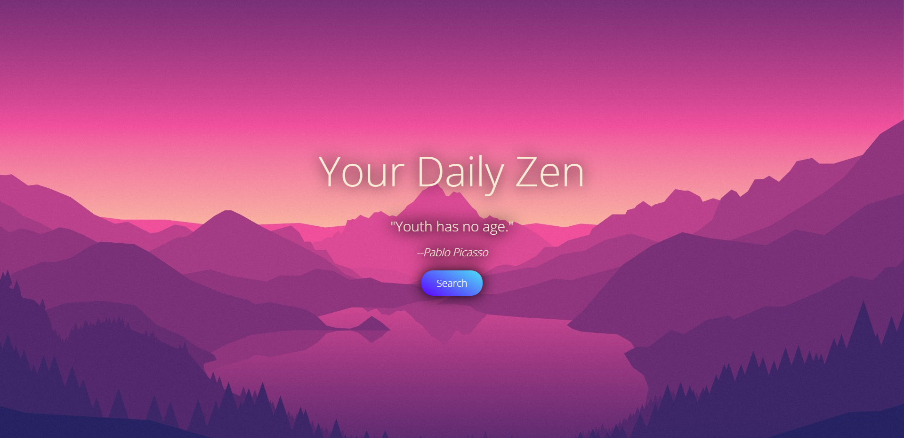

#### YourDailyZen
## A quote of the day generator for mindfulness and inspiration

## Technologies Used
* HTML5
* CSS3
* Javascript
* jQuery
* AJAX
* Zenquotes.io

<b>You may need to add a Cors extension to your browser in order for app to work.</b>

## Screenshots

## Getting Started
https://your-daily-zen.vercel.app/

## Recent Changes
* Switched to ZenQuotes.io for quote of the day feature.
* Reduced the amount of JS code needed to function properly.

## Future Enhancements
* Add feature that enables user to share quotes on social media.
* Incorporate multiple backgrounds that change with each page refresh.
* Add more functionality to the site to make it more accessible/fun.
